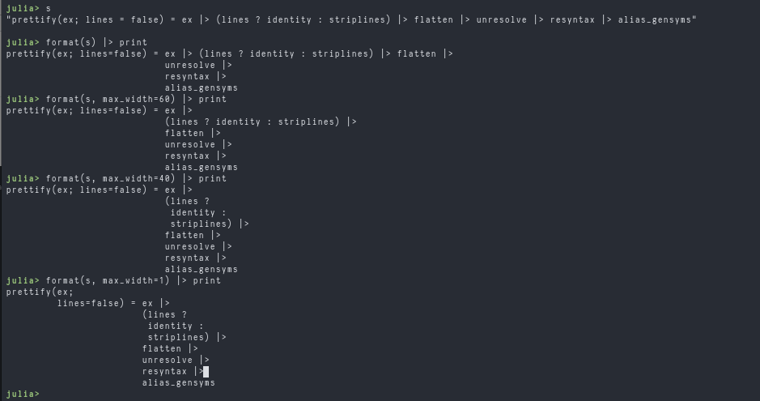

# JLFmt

[](https://travis-ci.org/domluna/JLFmt.jl)
[](https://coveralls.io/github/domluna/JLFmt.jl?branch=master)

**WARNING.** This an alpha release meant to find bugs. Overwrite files at your peril!

Width-sensitive formatter for Julia code. Inspired by gofmt and refmt projects.



```julia
]add https://github.com/domluna/JLFmt.jl
```

`JLFmt` exports a singular function:

```julia
format(text::String; indent_width=4, max_width=80)
```

* `indent_width` - the number of spaces used for an indentation.
* `max_width` - the maximum number of characters of code on a single line. Lines over
the limit will be nested if possible.

### How It Works

`JLFmt` parses the Julia file using [`CSTParser`](https://github.com/ZacLN/CSTParser.jl).

Next the CST is _prettified_ using `pretty`, creating a `PTree`. The printing output of a `PTree` is a canonical representation of the code removing unnecessary whitespace and joining or separating lines of code. The [`pretty` testset](./test/runtests.jl) displays these transformations.

Example 1:

```julia
function  foo
end
```

becomes

```julia
function foo end
```

Example 2:

```julia
for cond 1; 2; 3 end
```

becomes

```julia
for cond
    1
    2
    3
end
```

Once the `PTree` is created it's then nested using `nest!` to disjoin lines going over the
maximum width. The `PTree` is modified in-place. All expressions are nested front to back with the exception of binary operations, where operations, and conditionals.

Finally, the `PTree` to an `IOBuffer` with `print_tree` which is then consumed as a `String`.

### Known Limitations

* https://github.com/ZacLN/CSTParser.jl/issues/88
* https://github.com/ZacLN/CSTParser.jl/issues/94

If a comment is at the end of a line of code it will be removed.

```julia
var x = 10 # comment about x
```

Formatting will produce:

```julia
var x = 10
```

To get around with this write comments on separate lines.
